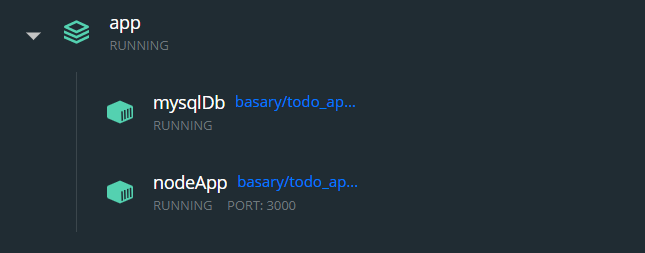

# Project: Todos App

### Overview
In this project, I experienced how to dockerize a project with Dockerfile, then with Docker Compose.  
This is a ```Todos Application``` that``` Mysql database``` and ```Node``` are used. With ```volumes``` your datas will not disappear for each starting the application.

To go to <b> Docker Hub repository:  https://hub.docker.com/r/basary/todo_app </b> <br>
To run the application clone the git repository and use the following <b>docker-compose.yml: </b> 
```
version: "3.7"

services:
  node_app:
    container_name: "nodeApp"
    image: basary/todo_app:node
    command: sh -c "yarn install && yarn run dev"
    ports:
      - 3000:3000
    working_dir: /app
    volumes:
      - ./:/app
    environment:
      MYSQL_HOST: db
      MYSQL_USER: root
      MYSQL_PASSWORD: secret
      MYSQL_DB: todos

  db:
    container_name: "mysqlDb"
    image: basary/todo_app:mysqlDb
    volumes:
      - todo-mysql-data:/var/lib/mysql
    environment:
      MYSQL_ROOT_PASSWORD: secret
      MYSQL_DATABASE: todos

volumes:
  todo-mysql-data:
```

## Output Examples
<p>How the application looks?</p>


<p>How the content table in database looks?</p>


<p>How the Docker Desktop looks?</p>

